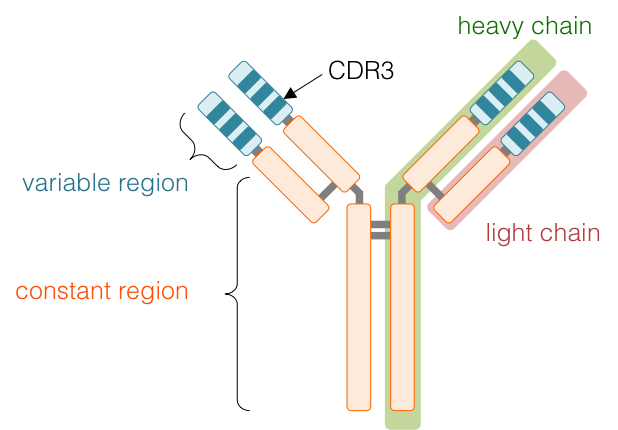
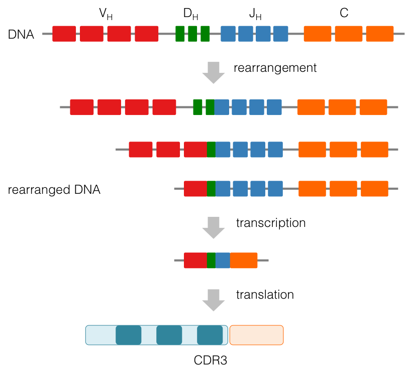

==========
Repertoire
==========

Repertoire diversity
====================

The diversity of repertoire is known to be generated by DNA rearrangements of the VDJ genes\ [#Tonegawa1983]_.
It is estimated that more than 10\ :sup:`18` different T cell receptors (TCRs)\ [#Robins2010]_
and more than 10\ :sup:`13` different B cell receptors (BCRs) in human\ [#Georgiou2014]_.

Immunoglobulin
^^^^^^^^^^^^^^

A unit of Ig is comprised of two heavy chains (IgH) and two light chains (IgL),
and each chain is comprised of a variable region and a constant region.
The variable region of IgH is comprised of single of V, D, and J genes.
CDR3 is defined between YYC motif at the end of V gene and WGxG motif at the start of J gene.
CDR3 is the most variable region on IgH sequence and predominantly determines the specificity of IgH\ [#Xu2000]_\ [#Benedict2000]_.

VDJ recombination
^^^^^^^^^^^^^^^^^

The variable region of IgH is generated by DNA rearrangements, also known as VDJ recombination.
During the recombination process, single of V, D, and J gene are randomly selected from sets of germline gene.
The rearrangement frequently results in nucleotide additions and deletions at the V-D and D-J junctions.
Therefore, the region around the junctions of V-D and D-J (i.e., CDR3) is known to be the most variable region on IgH sequence.

References
==========

.. [#Tonegawa1983] Tonegawa S. Somatic generation of antibody diversity. *Nature* 1983, **302**\ (5909):575-81. doi: `10.1038/302575a0 <https://dx.doi.org/10.1038/302575a0>`_.
.. [#Robins2010] Robins HS, Srivastava SK, Campregher PV, Turtle CJ, Andriesen J, Riddell SR, Carlson CS, Warren EH. Overlap and effective size of the human CD8+ T cell receptor repertoire. *Sci Transl Med.* 2010, **2**\ (47):47ra64. doi: `10.1126/scitranslmed.3001442 <https://dx.doi.org/10.1126/scitranslmed.3001442>`_.
.. [#Georgiou2014] Georgiou G, Ippolito GC, Beausang J, Busse CE, Wardemann H, Quake SR. The promise and challenge of high-throughput sequencing of the antibody repertoire. *Nat Biotechnol.* 2014, **32**\ (2):158-68. doi: `10.1038/nbt.2782 <https://dx.doi.org/10.1038/nbt.2782>`_.
.. [#Xu2000] Xu JL, Davis MM. Diversity in the CDR3 region of V(H) is sufficient for most antibody specificities. *Immunity.* 2000, **13**\ (1):37-45. doi: `10.1016/S1074-7613(00)00006-6 <https://dx.doi.org/10.1016/S1074-7613(00)00006-6>`_.
.. [#Benedict2000] Benedict CL, Gilfillan S, Thai TH, Kearney JF. Terminal deoxynucleotidyl transferase and repertoire development. *Immunol Rev.* 2000, **175**\ :150-7. doi: `10.1111/j.1600-065X.2000.imr017518.x <https://dx.doi.org/10.1111/j.1600-065X.2000.imr017518.x>`_.

