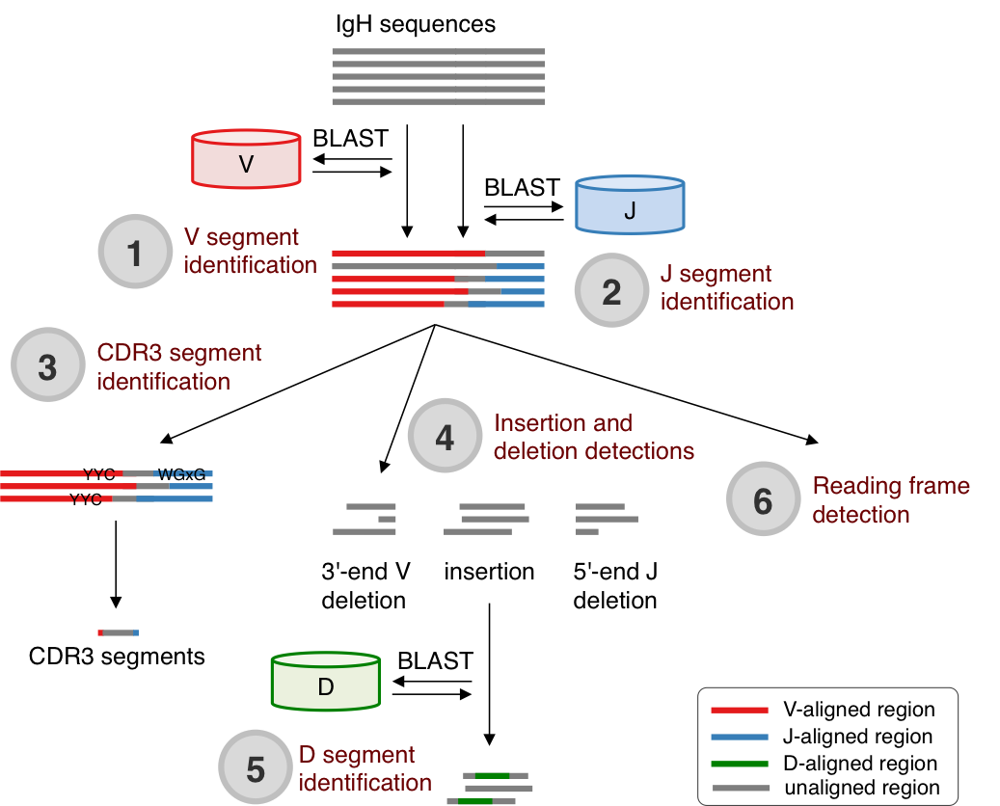

==============
Implementation
==============

PyDAIR offers two action modes, :command:`parse` and :command:`stats`.
The :command:`parse` action is used to identify V, D, J and CDR3 segments in IgH sequences with given Ig-Seq data.
On the other hand, the :command:`stats` action is used to summarize and visualize the analysis results.

parse action
============

:command:`parse` command is used to identify V, D, J, and CDR3 segments by the five steps.

#. To identify V segment,
   PyDAIR aligns each IgH sequence against user-defined BLAST database of V gene with :command:`blastn`.
   The best matching V gene is selected.
#. To identify J segment,
   PyDAIR aligns each IgH sequence against user-defined BLAST database of J gene with :command:`blastn`.
   The best matching J gene is selected.
#. To identify CDR3 segment, PyDAIR search for YYC and WGxG motifs using regular expression matching.
#. To identify D segment,
   PyDAIR aligns each each CDR3 segment sequence against user-defined BLAST database of D gene with :command:`blastn`.
   The best matching J gene is selected.
#. To determine open reading frame (ORF),
   PyDAIR searches for the start codon (ATG) and the stop codons (TAG, TAA, and TGA).
   PyDAIR tries the three possible reading frames to determine ORF.
   The sequence is defined as *productive* if one of reading frames dose not contain any stop codons.
   Otherwise, the sequence is defined as *unproductive*.

    

stats action
============

:command:`stats` command is to calculate V, D, and J segment usage frequencies,
and to summarize the distribution of length of CDR3 segment.
The analysis results are saved into TSV (tab-delimited) files.
In addition, the analysis results are visualized with some charts in an HTML report.

